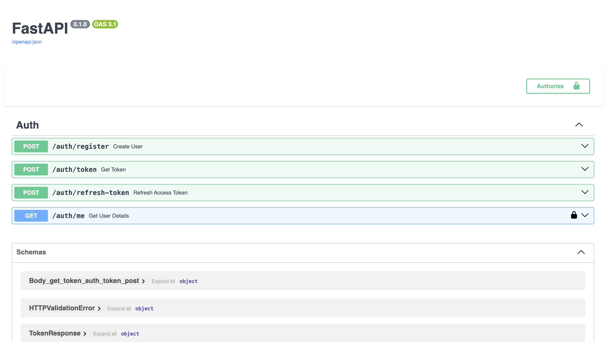

# FastAPI JWT auth

### Prerequisites

- Python 3.7 or later
- Install dependencies:

```bash
git clone https://github.com/prateekthakur272/fastapi_jwt_auth
cd fastapi_jwt_auth
pipenv install
```

### Run API
```bash
uvicorn main:app --reload
or
python main.py
```

## Documentation
To view api documentation click on [Documentation](http://127.0.0.1:8000/docs) after starting the server


